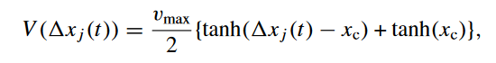

# ABM_CPMII

The structure of the project:
- in the directory json_data/ you can find two files 'drivers.json' and 'traffic.json'(where configuration of the simulation is stored)
- in src/model.py there is a TrafficModel class, which inherits from mesa.Model class
- in src/driver.py there is a Driver class, which inherits from mesa.Agent class
- in src/gui.py there is Gui class, that uses pygame module to display a real-time simulation of the model
- in main.py, you initialise a TrafficModel class and feed it to the Gui class to run the simulation
- in boid_flockers/ directory there is an example of mesa ABM, found on internet - ignore it.

To run the simulation:
1. Setup the config json files json_data/drivers.json and json_data/traffic.json
2. Run gui.py file

Behaviour of each agent is implemented in the Driver class. In the step() method, I implement a simple 'Microscopic car-following models'
If a car is the first in the lane, it accelerates until it reaches the max_speed value
If a car is following another car, it uses the formula (from nagatani2002.pdf <--- MUST READ AT LEAST THE FIRST FEW PAGES!W):

